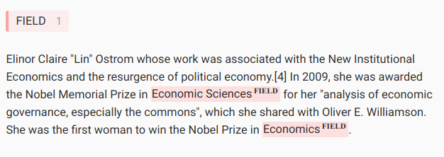

# About

This is a simple prototype of how to do Named-entity recognition (NER) using the [huggingface](https://huggingface.co/) library.



## Problem (hypothetical)

Given the wikipedia summary of a Nobel laureate, identify the field in which the person receieved the Nobel prize.

## Solution

- Prepare a very small dataset of only 10 sequences manually
- Label it using [label studio](https://labelstud.io/)
- Overfit a `Distilbert` model on the data
- Test the trained model on a new sentence

## Lessons learned

- `huggingface` API for models, tokenizers and custom datasets
- `label studio` seems like a great tool for different purposes
- I was surprised that the model is able to achieve 100% recall and precision on this small dataset quasi out of the box. While the problem seems very easy, fields may consist of one or three words (e.g. "Physics" versus "Physiology or Medicine") and they can appear multiple times in one sequence.
- `Distilbert` even fits on my 4GB laptop GPU using gradient accumulation.

# FAQ

## How to install

Simply create a docker container based on [`Dockerfile`](Dockerfile)

## How to run

- Run `simple_train.py` to train a model. This will save tensorboard logs and the final model in the `output` directory.
- Run `simple_inference.py` to run inference on the test dataset or any given sentence.

# Notes

## How to define a custom dataset in huggingface

- https://huggingface.co/docs/datasets/loading_datasets.html#from-local-or-remote-files
- https://huggingface.co/transformers/v3.2.0/custom_datasets.html
- https://github.com/huggingface/datasets/blob/master/datasets/conll2003/conll2003.pys
- only need two columns: "tokens" and "ner_tags"

## How to label

- see https://github.com/doccano/awesome-annotation-tools for comparison
  - docker container start doccano
    - > bug with exported json :/, see https://github.com/doccano/doccano/issues/1606
  - bart
    - > cannot download :/, also maybe outdated?!
  - cd pwd/mnt/sda1/projects/git/prototypes/202112_ner/data/NER_Einstein
  - docker run -it -p 8080:8080 heartexlabs/label-studio:1.4.0
  - docker run -it -p 8080:8080 -v /mnt/sda1/projects/git/prototypes/202112_ner/data/NER_Einstein/mydata:/label-studio/data heartexlabs/label-studio:1.4.0 label-studio --log-level DEBUG
  - docker run -it -p 8080:8080 -v /tmp/mydata:/label-studio/data heartexlabs/label-studio:1.4.0 label-studio --log-level DEBUG
    - > works and can even export conll-format :)

## How to start labeling studio

```bash
LOCAL_DIR="/mnt/sda1/projects/git/prototypes/202112_ner/data/label_studio"
CONTAINER_DIR="/label-studio/data"
docker run -it -p 8080:8080 -v $LOCAL_DIR:$CONTAINER_DIR heartexlabs/label-studio:1.4.0
```

## How to use NER with hugging-face?

- NER is a subset of Token-classification
  - https://github.com/huggingface/transformers/tree/master/examples/pytorch/token-classification
  - token classification =
    - parts-of-speech tagging (POS) -> classify as VERB, NOUN, ...
    - named entity recognition (NER) -> classify as PERSON, LOC, ...
    - phrase extraction (CHUNKS)
    - see https://stackabuse.com/python-for-nlp-parts-of-speech-tagging-and-named-entity-recognition/

## How to run NER training using run_ner.py?

```bash
pip install datasets
pip install seqeval  # required for evaluating

python3 run_ner.py \
  --model_name_or_path bert-base-uncased \
  --dataset_name conll2003 \
  --output_dir /tmp/test-ner \
  --do_train \
  --do_eval \
  --max_train_samples 3 \
  --max_eval_samples 5 \
  --overwrite_output_dir
```

## How to compute metric?

- see https://huggingface.co/metrics/seqeval
- forwards to https://github.com/chakki-works/seqeval

```python
>>> y_true = [['O', 'O', 'O', 'B-MISC', 'I-MISC', 'I-MISC', 'O'], ['B-PER', 'I-PER', 'O']]
>>> y_pred = [['O', 'O', 'B-MISC', 'I-MISC', 'I-MISC', 'I-MISC', 'O'], ['B-PER', 'I-PER', 'O']]
>>> f1_score(y_true, y_pred)
0.50
```

## How to label using doccano?

https://github.com/doccano/doccano

```bash
# create container
docker pull doccano/doccano
docker container create --name doccano \
  -e "ADMIN_USERNAME=admin" \
  -e "ADMIN_EMAIL=admin@example.com" \
  -e "ADMIN_PASSWORD=password" \
  -p 8000:8000 doccano/doccano

# start container, go to http://127.0.0.1:8000/
docker container start doccano

# to stop
docker container stop doccano -t 5
```

## Why does tokenizer sometimes split word?

- ['EU', 'rejects', 'German', 'call', 'to', 'boycott', 'British', 'lamb', '.']
- ['[CLS]', 'EU', 'rejects', 'German', 'call', 'to', 'boycott', 'British', 'la', '##mb', '.', '[SEP]', '[PAD]', '[PAD]', ...]
